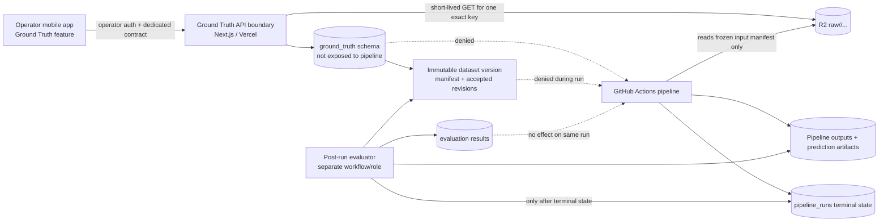
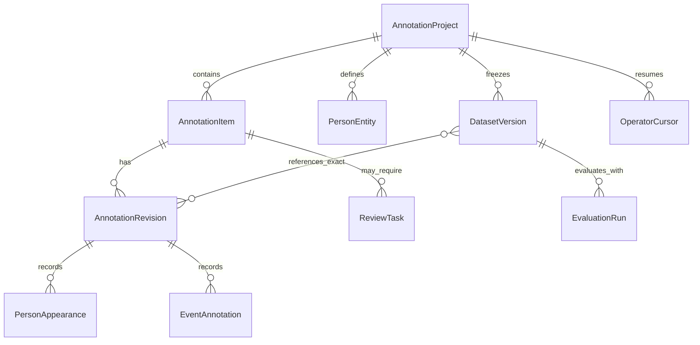
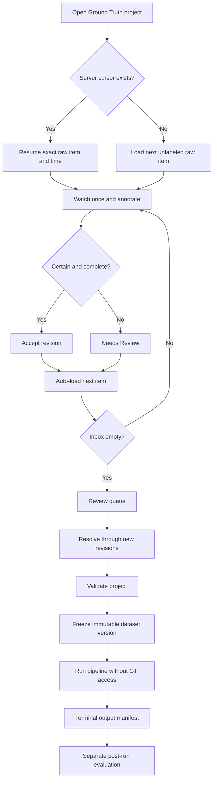

# SportReel Ground Truth Annotation System — Design Source of Truth

Date: 2026-07-24  
Repository: `yotamfried-ux/Video-editing-with-drone`  
Status: **design approved for future implementation only — no runtime, UI, API, database, or pipeline change is implemented by this document**  
Audit tracking: `docs/app-pipeline-audit.md` → `GAP-027`

## 1. Purpose

SportReel needs a small, product-specific ground-truth system that lets an authorized operator annotate immutable raw source videos and later compare those human annotations with a completed pipeline run.

The system is for:

- measuring pipeline quality;
- creating reproducible evaluation datasets;
- finding identity, coverage, event-boundary, and selection failures;
- supporting offline replay and result-loop decisions after a run.

The system is not:

- a general-purpose labeling platform;
- a replacement for Label Studio or a cloud labeling service;
- a live training loop;
- a source of hints, labels, prompts, rankings, or decisions during a pipeline run;
- an extension of `draft_feedback`;
- a screen for reviewing drafts, rendered outputs, or approved reels.

## 2. Non-negotiable decisions

1. **Blind evaluation is the primary contract.** Human ground truth is invisible to the pipeline before and during a run. Evaluation begins only after the pipeline has reached a durable terminal state and its output manifest is frozen.
2. **Raw-only source authority.** Annotation items reference verified immutable objects under `raw/<batch_id>/...` through durable `source_uploads` identity. Drafts, pipeline outputs, review media, processed media, and approved reels are never annotation inputs.
3. **Dedicated trust domain.** Ground-truth data, credentials, API routes, storage access, and database permissions are separate from pipeline runtime and from the existing operator-feedback learning loop.
4. **No names or account biometrics.** Human identity is dataset-scoped and pseudonymous: `SURFER-001`, `SURFER-002`, and so on. No real name, face enrollment, face embedding, or account ownership inference is stored.
5. **Mobile-first, one-pass operation.** The primary workflow is watch once → annotate with large controls → auto-advance. The default queue shows only unfinished work.
6. **Append-only history.** Autosave and undo never erase history. Corrections create a new revision or compensating action. Frozen dataset versions are immutable.
7. **Human labels are not automatically promoted to production behavior.** A separate, reviewed future decision may convert an observed failure into a replay case, policy change, or training set. The evaluation dataset itself remains isolated.
8. **No vendor runtime dependency.** Google, AWS, and Azure documentation supplies patterns and constraints. SportReel owns the implementation because the product requires a narrow workflow, the current stack is Supabase/R2/Vercel/Expo, Google Document AI HITL is retired, and AWS Ground Truth/A2I closes new-customer access on 2026-07-30.

## 3. Repository fit and existing boundaries

Current SportReel architecture is:

```text
Operator mobile app
  -> Next.js web-api
  -> GitHub Actions
  -> Python pipeline
  -> R2 + Supabase
```

The existing repository already establishes:

- immutable raw object keys under `raw/<batch_id>/...`;
- durable `source_uploads` and `upload_batches`;
- a frozen input manifest before dispatch;
- privileged mobile operations through `operatorFetch()` and the web-api;
- service-role-only upload mutations with RLS;
- a separate `draft_feedback` path that can inject recent operator feedback into later Gemini prompts.

The last point is decisive: **ground truth must not reuse `draft_feedback` or any table, route, credential, or Python consumer that can affect future analysis.**

## 4. Official-source findings and adopted patterns

### 4.1 Google Vertex AI Data Labeling

Official Vertex AI examples model labeling as a durable job that names:

- a dataset;
- an instruction resource;
- an annotation schema;
- an annotation set;
- a worker count or specialist pool.

Vertex AI also models annotations as assignments of an annotation specification to a data item or a region of a data item. Its managed-dataset documentation supports video datasets and video action-recognition schemas.

**Adopted for SportReel**

- explicit annotation projects;
- versioned label taxonomy and instructions;
- separate annotation sets/purposes;
- data-item identity independent of labels;
- project-level worker and scope configuration;
- immutable identifiers instead of filenames as the join key.

**Not adopted**

- Vertex AI as the production annotation backend;
- generic cloud labeling-job orchestration;
- model-assisted prelabels in the blind evaluation queue.

### 4.2 Google dataset versioning and evaluation isolation

Vertex AI dataset versions are intended for reproducibility, traceability, and lineage. Google ML guidance requires a separate test set for evaluation on unseen data and warns that repeated development against the same test set reduces its independence.

**Adopted for SportReel**

- draft projects can evolve, but a frozen dataset version cannot;
- a frozen version records exact source identities, source hashes, accepted annotation revision IDs, taxonomy version, and instruction version;
- every evaluation result records the dataset version, pipeline commit, run, configuration, and prediction manifest;
- corrections to frozen truth create a successor version rather than mutating history;
- evaluation datasets are separated from monitoring data and from any data later promoted for training or prompt improvement.

### 4.3 Google Human-in-the-loop

Document AI Human-in-the-Loop documented manager/labeler roles and review workflows, but it was deprecated on 2024-01-16 and unavailable after 2025-01-16.

**Adopted for SportReel**

- role separation;
- a manager-owned project;
- a labeler task queue;
- explicit review/adjudication state.

**Not adopted**

- any dependency on the retired service.

### 4.4 AWS SageMaker Ground Truth

Ground Truth documents:

- video clip classification;
- video-frame object detection and tracking;
- verification jobs that accept/reject labels without editing;
- adjustment jobs that create corrected labels;
- input and output manifests;
- worker instructions;
- save, stop, resume, decline, shortcuts, and review workflows;
- multiple-worker consolidation.

AWS currently states that Ground Truth closes access to new customers on 2026-07-30.

**Adopted for SportReel**

- one source item per focused task;
- separate annotation, verification, and adjustment concepts;
- task-level autosave and resume;
- output manifests with human-annotation metadata;
- review comments and uncertainty;
- event/frame attributes;
- revision history rather than destructive overwrite;
- future support for independent double-labeling and adjudication.

**Not adopted**

- frame-by-frame bounding-box tooling in the first implementation;
- a marketplace/public workforce;
- Ground Truth as a runtime dependency;
- periodic-only autosave: SportReel saves every accepted action.

### 4.5 AWS Augmented AI

A2I models a human-review flow as a separate flow definition with:

- a task type;
- a worker task template and instructions;
- a workforce;
- activation conditions such as low confidence or random sampling;
- durable human-loop status and output.

AWS currently states that A2I closes access to new customers on 2026-07-30.

**Adopted for SportReel**

- review flow is a first-class resource;
- `Needs Review` is a distinct queue, not a weak completed state;
- evaluation and review have durable terminal statuses;
- later quality-control sampling may select a random subset for independent re-annotation.

**Not adopted**

- routing predictions to humans during the production run;
- showing the operator the pipeline's current prediction while creating blind truth.

### 4.6 Azure Machine Learning Data Labeling

Azure documents projects that coordinate data, labels, team members, incomplete-task queues, progress, pause/resume, review, skipped items, consensus, `Needs Review`, exports, and role-limited labeler access. Its instruction guidance explicitly asks what labelers should do when no label fits, multiple labels fit, confidence is low, objects overlap or are occluded, quality is poor, or a mistake is discovered.

Azure's built-in data-labeling documentation is for image and text projects, not a SportReel-compatible native video workflow.

**Adopted for SportReel**

- Inbox-style incomplete queue;
- explicit `Unknown`/`Other` and uncertainty paths;
- task-oriented instructions;
- project progress and queue filters;
- reject-to-unlabeled/review behavior;
- role-limited access;
- future consensus/adjudication support.

**Not adopted**

- prelabels, because seeing model predictions would break blind annotation;
- Azure as the video-labeling backend;
- a generic label taxonomy editor in the mobile app.

### 4.7 Android mobile accessibility

Android guidance recommends touch targets of at least `48dp × 48dp`.

**Adopted for SportReel**

- every primary action has at least a 48dp touch target;
- common actions use larger full-width or thumb-zone controls;
- no icon-only destructive or ambiguous action;
- event controls remain reachable without precision tapping.

### 4.8 Supabase and R2 security

Supabase documentation requires RLS on exposed data and warns that service-role/secret keys bypass RLS and must never be exposed to clients. R2 presigned URLs authorize one operation on one object until expiry and must be treated as bearer tokens.

**Adopted for SportReel**

- ground-truth tables live in a non-exposed schema by default;
- mobile never receives a service-role key;
- dedicated server credentials have no pipeline runtime use;
- annotation reads use short-lived `GET` URLs for exactly one allowed raw object;
- no bucket listing, wildcard prefix token, write URL, or processed/review/approved access is issued to the annotation client.

## 5. Architecture



### 5.1 Trust zones

- **Annotation zone:** operator mobile feature, dedicated API routes, ground-truth database role/schema, exact raw-object read URL.
- **Pipeline zone:** GitHub Actions runtime, pipeline role, frozen upload input manifest, prediction and diagnostics output.
- **Evaluation zone:** post-run evaluator with read access to one frozen ground-truth version and one terminal run's frozen prediction artifacts.
- **Learning/feedback zone:** existing feedback and future replay promotion. It can consume explicitly approved evaluation findings later, but it cannot mutate the frozen version.

### 5.2 Required physical separation

Logical naming alone is insufficient. Future implementation must enforce all of the following:

- no ground-truth secret in pipeline workflow environments;
- no database grant from the pipeline role to the ground-truth schema;
- no ground-truth route imported by pipeline code;
- no annotation payload in dispatch, input manifest, R2 raw metadata, filename, or sidecar;
- no prediction artifact returned by the annotation API;
- no evaluation workflow start until a durable terminal pipeline state and frozen output manifest exist.

## 6. Logical data model proposal

This section defines future logical entities. It does **not** create database tables or migrations.

### 6.1 `AnnotationProject`

Purpose: a bounded labeling project for one sport, taxonomy, instruction set, and raw-source collection.

Core fields:

- `project_id`
- `name`
- `sport`
- `status`: `draft | active | paused | review | frozen | archived`
- `taxonomy_version`
- `instruction_version`
- `created_by`
- `created_at`
- `updated_at`

Rules:

- taxonomy and instructions are immutable within a frozen version;
- a material taxonomy change requires a new project revision or successor project;
- only operator/admin roles can access the project.

### 6.2 `AnnotationItem`

Purpose: a stable task that points to one verified canonical raw source.

Core fields:

- `item_id`
- `project_id`
- `source_upload_id`
- `batch_id`
- `raw_storage_key`
- `source_sha256`
- `source_size_bytes`
- `duration_ms`
- `source_manifest_version`
- `queue_status`: `unlabeled | in_progress | needs_review | completed | excluded`
- `current_revision_id`
- `assigned_operator_id`
- `started_at`
- `completed_at`

Rules:

- the item is eligible only when the source is verified and canonical;
- `raw_storage_key` must start with the item's exact `raw/<batch_id>/` prefix;
- source hash or identity mismatch blocks annotation and evaluation;
- the item never points to `processed/`, `review/`, `approved/`, drafts, or generated media.

### 6.3 `PersonEntity`

Purpose: a project-scoped anonymous human identity.

Core fields:

- `person_id`
- `project_id`
- `display_code`: generated `SURFER-001`, `SURFER-002`, ...
- `sport_role`: optional non-identifying role
- `status`: `active | merged | split | retired`
- `superseded_by`
- `created_revision_id`

Rules:

- no name, email, account ID, face embedding, or biometric template;
- merge/split is auditable and creates a revision;
- display codes are stable within a project/version;
- identity comparisons use human observations from raw sources only.

### 6.4 `AnnotationRevision`

Purpose: immutable snapshot of one item's human truth at one point in time.

Core fields:

- `revision_id`
- `item_id`
- `revision_number`
- `supersedes_revision_id`
- `state`: `draft | submitted | needs_review | accepted | superseded`
- `usability`
- `usability_reason_codes`
- `primary_person_id`
- `confidence`
- `optional_note`
- `created_by`
- `created_at`
- `client_action_id`
- `schema_version`

Rules:

- append-only;
- idempotent by `client_action_id`;
- optimistic concurrency rejects writes based on a stale current revision;
- one-step undo creates a compensating revision;
- a completed item references an accepted revision;
- frozen versions reference exact accepted revision IDs.

### 6.5 `PersonAppearance`

Purpose: connect all people visible in one raw item to anonymous person entities.

Core fields:

- `appearance_id`
- `revision_id`
- `person_id` or `unknown_token`
- `is_primary`
- `appearance_confidence`
- `first_seen_ms`
- `last_seen_ms`
- `evidence_frame_ms` optional

Rules:

- exactly one primary person when the item is usable and a meaningful action has a primary athlete;
- multiple people are allowed;
- `Unknown` is explicit and never silently converted to a known person;
- later correction preserves the prior mapping in revision history.

### 6.6 `EventAnnotation`

Purpose: human temporal truth for actions and important moments.

Core fields:

- `event_id`
- `revision_id`
- `event_type`
- `start_ms`
- `end_ms`
- `key_moment_ms[]`
- `primary_person_id`
- `usability`
- `reason_codes`
- `confidence`

Rules:

- `start_ms <= key_moment <= end_ms`;
- events must remain within source duration;
- overlapping events are allowed when justified;
- the first implementation labels temporal boundaries and key moments, not dense frame boxes;
- every usable surfing wave should be represented exactly once or explicitly rejected.

### 6.7 `ReviewTask`

Purpose: keep uncertainty out of the completed queue without blocking throughput.

Core fields:

- `review_task_id`
- `item_id`
- `revision_id`
- `reason_codes`
- `status`: `open | resolved | returned_to_queue | excluded`
- `created_by`
- `resolved_by`
- `resolution_revision_id`
- timestamps

Rules:

- `Needs Review` immediately advances the operator to the next item;
- the default annotation inbox excludes review items;
- review resolution never edits the old revision;
- optional notes are allowed, but structured reason codes are required.

### 6.8 `OperatorCursor`

Purpose: exact resume across app restart or device loss.

Core fields:

- `project_id`
- `operator_id`
- `current_item_id`
- `playback_position_ms`
- `current_revision_id`
- `last_action_id`
- `updated_at`

Rules:

- server cursor is authoritative;
- local storage may cache it for fast startup;
- a stale local cursor is reconciled against the server before editing;
- completed items cannot be reopened through the inbox cursor.

### 6.9 `DatasetVersion`

Purpose: immutable evaluation truth.

Core fields:

- `dataset_version_id`
- `project_id`
- `semantic_version`
- `status`: `building | validation_failed | frozen | retired`
- `taxonomy_version`
- `instruction_version`
- `manifest_hash`
- `item_count`
- `person_count`
- `event_count`
- `frozen_by`
- `frozen_at`
- `parent_version_id`

The version manifest contains, for every item:

- source upload ID;
- exact raw key;
- SHA-256 and size;
- accepted annotation revision ID;
- accepted person/event IDs;
- exclusion status and reason.

Rules:

- freeze is atomic;
- any unresolved item, missing hash, missing accepted revision, or duplicate canonical source blocks freeze;
- frozen rows and referenced revisions are immutable;
- corrections create a successor version.

### 6.10 `EvaluationRun`

Purpose: compare one terminal pipeline run with one frozen ground-truth version.

Core fields:

- `evaluation_run_id`
- `dataset_version_id`
- `pipeline_run_id`
- `pipeline_commit_sha`
- `pipeline_config_hash`
- `prediction_manifest_hash`
- `evaluator_version`
- `status`
- `started_at`
- `completed_at`
- metric summary
- artifact references

Rules:

- unique for the complete comparison identity;
- refuses non-terminal, stale, incomplete, or mismatched runs;
- writes results only to the evaluation zone;
- cannot update the pipeline run's predictions or same-run decision path.



## 7. Annotation taxonomy

### 7.1 Usability

Required values:

- `usable`
- `not_usable`
- `partially_usable`
- `uncertain`

Structured reason codes should include at least:

- `no_meaningful_action`
- `action_incomplete`
- `subject_not_readable`
- `wrong_or_unknown_primary`
- `severe_occlusion`
- `camera_or_focus_failure`
- `source_corrupt`
- `duplicate_source_action`
- `partial_window_only`
- `other_needs_review`

Free text is optional and never substitutes for reason codes.

### 7.2 Identity

Required actions:

- select an existing project person;
- create a new anonymous person;
- mark `Unknown`;
- mark the same person as another raw item;
- correct a prior merge/split through a reviewed revision.

Identity labels must not display or derive pipeline clusters, track IDs, person descriptions, filenames, draft titles, or generated predictions.

### 7.3 Primary athlete

When multiple people appear, the operator identifies the athlete who owns the meaningful action. Other participants remain context rather than automatic defects.

Possible values:

- one selected project person;
- `no_primary_action`;
- `uncertain_primary` → review.

### 7.4 Events

Minimum temporal labels:

- action start;
- action end;
- one or more important moments.

Initial sport-specific event vocabulary should start small and versioned. Surfing examples:

- `wave_ride`
- `takeoff`
- `turn`
- `aerial_or_high_impact_move`
- `fall_or_recovery`
- `social_moment`
- `other_action`

A taxonomy addition after labeling starts must follow the documented project/version migration path; it cannot silently change historical meaning.

### 7.5 Human confidence

Required values:

- `certain`
- `fairly_certain`
- `uncertain`

`uncertain` should normally route the item or specific identity/event decision to `Needs Review`.

## 8. Mobile-first UX design

### 8.1 Information architecture

Operator-only navigation:

- `Ground Truth`
  - `Inbox`
  - `Needs Review`
  - `Completed`
  - `Datasets`
  - `Evaluation` (future phase)

No entry is shown to ordinary users.

### 8.2 Inbox Zero behavior

Default screen rules:

- show only `unlabeled` items plus the operator's exact resumable `in_progress` item;
- never show completed items;
- never mix `Needs Review` into the main inbox;
- after completion or review deferral, auto-load the next item;
- when no item remains, show project completion and review counts.

### 8.3 One-pass screen layout

```text
┌──────────────────────────────────┐
│ Project · 18/40 · 45%            │
│ Video 00:12 / 00:27              │
├──────────────────────────────────┤
│                                  │
│         RAW VIDEO PLAYER         │
│                                  │
│ [Start] [Key moment] [End]       │
├──────────────────────────────────┤
│ Usability: [Yes] [Partial] [...] │
│ Identity:  [SURFER-003] [New]    │
│ Primary:   [Select large chip]   │
│ Confidence:[Certain] [Fair] [?]  │
├──────────────────────────────────┤
│ [Needs Review]       [Complete]  │
└──────────────────────────────────┘
```

Detailed behavior:

1. Player opens the exact raw item at the saved position.
2. Large timestamp controls capture start, key moment, and end during playback.
3. Usability uses large chips; reason chips appear only when needed.
4. Identity offers recently used anonymous people, search by code, `New person`, and `Unknown`.
5. Selecting `New person` allocates the next code server-side.
6. Primary athlete selection uses the people already marked visible.
7. Confidence is one tap.
8. As soon as required fields are valid at video end, `Complete` is reachable in the thumb zone.
9. Completion writes an accepted revision, advances the queue, and preloads only the next raw item.
10. No model prediction, draft, output, score, or prior pipeline decision appears anywhere.

### 8.4 Autosave

Every semantic action is written immediately with:

- `client_action_id`;
- expected revision number;
- item and project IDs;
- action type and payload;
- device timestamp and server timestamp.

UI states:

- `Saving…`
- `Saved`
- `Offline — action queued`
- `Conflict — reload required`

The screen must not auto-advance until the completion/review transition is durably acknowledged.

### 8.5 Resume

On app launch:

1. authenticate operator;
2. fetch active project and server cursor;
3. verify item remains editable and raw identity still matches;
4. reconcile unsent local actions idempotently;
5. reopen exact item and playback position;
6. restore current labels and one-step undo state.

### 8.6 Undo

- one prominent undo action remains available after each semantic edit;
- undo creates a compensating action/revision;
- completion auto-advance offers a brief `Undo completion` action that returns the same item only after the server reverses the queue transition;
- older edits are handled from `Completed`, not by a long undo stack.

### 8.7 Needs Review

One tap:

- records required structured uncertainty reasons;
- preserves partial work;
- creates a `ReviewTask`;
- removes the item from Inbox;
- loads the next item.

### 8.8 Completed editing

`Completed` is a separate screen:

- filter by anonymous person code, date, batch, or usability;
- open an item explicitly;
- start a new revision from the accepted revision;
- save correction;
- mark any frozen dataset versions that reference the old revision as historical, never mutated;
- require a new dataset version before corrected truth is used in evaluation.

### 8.9 One-handed and accessible interaction

- primary controls at least 48dp, normally larger;
- persistent bottom action area;
- no tiny overflow menu for common actions;
- no long form;
- structured chips before optional text;
- no required drag gesture;
- labels accompany icons;
- destructive merge/split/exclude actions require a confirmation screen.

## 9. Operator workflow



## 10. Blind Evaluation Contract

### 10.1 Inputs forbidden to the pipeline

The pipeline and all pipeline-triggered code must not read or receive:

- usability labels or reason codes;
- anonymous identity assignments;
- primary-athlete labels;
- event boundaries or key moments;
- confidence;
- notes;
- review decisions;
- annotation status;
- dataset-version manifest;
- evaluation results for the same run.

Forbidden transport surfaces include:

- GitHub dispatch payload;
- workflow inputs;
- environment variables and secrets;
- raw object metadata;
- filenames or folder names;
- upload/source manifest fields;
- Supabase queries;
- generated sidecars;
- caches or artifacts downloaded before completion.

### 10.2 Permitted pipeline inputs

Only the existing production inputs are allowed:

- frozen verified raw input manifest;
- raw media;
- product configuration;
- model/perception/editor configuration;
- explicitly approved production feedback mechanisms already governed outside this dataset.

### 10.3 Evaluation activation gate

Evaluation may start only when:

- target dataset version is `frozen`;
- every dataset source hash still matches;
- target pipeline run is durable terminal;
- prediction/candidate/coverage/output manifests are frozen and hashable;
- run commit and configuration are recorded;
- no output artifact is still changing.

### 10.4 Evaluation outputs

Allowed outputs:

- aggregate metrics;
- per-item mismatches;
- false merge/split evidence;
- missed/extra event windows;
- selection and rejection disagreements;
- links to raw evidence and prediction artifacts for operator investigation;
- a result-loop recommendation.

Evaluation output must not:

- alter the evaluated run;
- silently enter future prompts or training;
- mutate ground truth;
- mark a product gap closed without visual and artifact review.

### 10.5 Enforcement tests

Future implementation requires deterministic positive and negative checks:

1. pipeline credential cannot select ground-truth rows;
2. annotation credential cannot list/read pipeline outputs;
3. annotation API rejects non-raw keys and cross-batch keys;
4. pipeline workflow contains no ground-truth secret or environment name;
5. static scan rejects pipeline imports/references to ground-truth modules, routes, schema, or variables;
6. dispatch and frozen input manifests reject annotation fields;
7. evaluator rejects non-terminal runs;
8. evaluator rejects mutable/unfrozen dataset versions;
9. evaluator rejects source hash or manifest mismatch;
10. a canary ground-truth value never appears in pipeline logs, prompts, artifacts, or outputs;
11. ordinary authenticated users receive `403`/no route visibility;
12. completed/review/freeze transitions are idempotent and concurrency-safe.

## 11. Security model

### 11.1 Authorization

Target roles:

- `operator`: label, resume, complete, defer, and edit completed items;
- `admin`: create/pause projects, change versioned instructions/taxonomy, resolve identity merge/split, freeze versions, start evaluation;
- ordinary users: no discovery, route, row, object, or metric access.

For the initial single-user deployment, the same human may hold both roles, but authorization must remain explicit and server-validated.

### 11.2 Database

Future proposal:

- dedicated non-exposed `ground_truth` schema;
- dedicated least-privilege database role for the Ground Truth API;
- separate evaluator read role and evaluation writer role;
- no grants to `anon`, normal `authenticated`, or the pipeline role;
- RLS as defense in depth using explicit operator/admin claims;
- no client service-role key;
- security-invoker views only if a view is later exposed;
- append-only audit log for every mutation, freeze, evaluation, merge, and split.

### 11.3 API

Future routes live under a dedicated operator namespace, for example:

```text
/api/operator/ground-truth/projects
/api/operator/ground-truth/items/next
/api/operator/ground-truth/items/:id/actions
/api/operator/ground-truth/review
/api/operator/ground-truth/completed
/api/operator/ground-truth/dataset-versions
/api/operator/ground-truth/evaluations
```

This is a design namespace, not an implementation in this change.

Rules:

- use the existing privileged operator boundary pattern;
- validate operator/admin role server-side on every request;
- exact typed request/response contracts;
- idempotency for every mutating action;
- optimistic concurrency;
- rate limits and bounded payloads;
- audit correlation ID;
- no generic raw-key parameter accepted from the client when a server-resolved item ID is sufficient.

### 11.4 Raw media access

- server verifies project membership and item state;
- server resolves the immutable raw key from `source_upload_id`;
- server issues a short-lived `GET` presigned URL for that exact object;
- URL is treated as a bearer token and never logged;
- no list, write, delete, or prefix-wide permission;
- no URL for `processed/`, `review/`, `approved/`, `previews/`, or `pending_payment/`.

### 11.5 Secrets and CI

Separate secret families:

- `PIPELINE_*` — must not access ground truth;
- `GROUND_TRUTH_API_*` — annotation service only;
- `EVALUATOR_*` — post-run read/join/write only.

CI must inventory workflow permissions and reject cross-zone secret references.

## 12. Quality assurance model

### 12.1 Initial single-operator mode

Because the initial labeler is one operator:

- every uncertain item goes to `Needs Review`;
- project freeze requires review queue empty or explicit exclusions;
- a random sample is re-annotated blind before first freeze to measure intra-annotator consistency;
- identity merge/split and dataset freeze require admin confirmation;
- high-impact corrections create a successor dataset version.

### 12.2 Future multi-annotator mode

If more operators are added:

- independent annotations are stored separately;
- no annotator sees another annotation or model prediction before submission;
- disagreement produces an adjudication task;
- consensus never destroys individual labels;
- accepted truth references the adjudication revision and contributing annotations.

### 12.3 Project validation before freeze

Block freeze when any of the following exists:

- unfinished or unresolved item;
- verified raw source missing or hash mismatch;
- accepted revision missing;
- usable item without a valid primary athlete;
- event outside duration or invalid boundaries;
- anonymous person code collision;
- source duplicated in the version;
- identity merge/split unresolved;
- instruction or taxonomy version missing;
- version manifest hash cannot be reproduced.

## 13. Evaluation metrics

Metrics are computed against the frozen human truth, not against operator feedback.

### 13.1 Identity

- pairwise identity precision, recall, and F1;
- false-merge rate;
- false-split rate;
- cluster coverage;
- primary-athlete accuracy;
- unknown/uncertain handling rate;
- identity coverage by source and event.

### 13.2 Usability and selection

- usability classification accuracy and macro F1;
- usable-action selection precision;
- usable-action selection recall;
- hard-reject precision and recall;
- athlete coverage: eligible athletes represented or explicitly rejected;
- action/wave coverage;
- duplicate physical-action rate;
- missed usable action count;
- selected unusable action count.

### 13.3 Events

- event detection precision, recall, and F1;
- temporal intersection-over-union;
- start-boundary absolute error;
- end-boundary absolute error;
- key-moment hit rate within a versioned tolerance;
- early-cut and late-cut rates;
- event-to-primary-athlete attribution accuracy.

### 13.4 Run-level product metrics

- one-primary-reel-per-eligible-athlete compliance;
- every usable surfing wave exactly once compliance;
- false crossover count;
- unexplained dropped action count;
- deterministic technical compliance;
- QA-blocked rate and approval-without-reedit rate;
- metric deltas versus the nominated baseline version/run.

### 13.5 Reporting rules

- publish numerator, denominator, exclusions, tolerance version, and confidence interval where meaningful;
- never report `0` failure when the denominator or evidence is missing;
- distinguish `pass`, `fail`, and `inconclusive`;
- deterministic identity/coverage/safety metrics gate editorial model-grader results;
- no single aggregate score can hide a false merge, false split, missing athlete, or missing usable wave.

## 14. Dataset lifecycle

```text
Project draft
  -> active annotation
  -> review and validation
  -> freeze candidate
  -> immutable DatasetVersion v1
  -> post-run evaluations
  -> correction discovered
  -> new annotation revision
  -> immutable DatasetVersion v2
```

### 14.1 Freeze

Freeze captures:

- exact source manifest and hashes;
- accepted revisions;
- person/entity lineage;
- event truth;
- taxonomy/instruction versions;
- validation report;
- operator/admin identity and timestamp;
- content-addressed manifest hash.

### 14.2 Revision and correction

- annotations remain editable while the project is not frozen;
- correction after freeze does not change v1;
- correction creates a new revision and then v2;
- evaluations remain tied to the version originally used;
- lineage states why v2 superseded v1.

### 14.3 Retention

- ground truth primarily stores metadata and raw references, not duplicate full videos;
- raw retention must remain sufficient for reproducible evaluation;
- deleting or superseding a raw object requires an explicit impact check against frozen versions;
- exports contain manifests/annotations, never secrets or presigned URLs.

## 15. Implementation phases

### Phase 0 — Design registration (this change)

- [x] Read current repository architecture and audit.
- [x] Research required official Google, AWS, Azure, Android, Supabase, and R2 sources.
- [x] Define architecture, logical model, UX, blind contract, security, metrics, phases, and migration.
- [x] Register `GAP-027` as open.
- [ ] No feature implementation begins.

### Phase 1 — Prerequisites and threat model

Starts only after blocking upload/infrastructure conditions are closed.

- confirm exact operator/admin authorization source;
- define schema/API/workflow contracts;
- define threat model and trust-zone credentials;
- freeze taxonomy v1 and task instructions;
- define raw-retention and dataset-deletion policy;
- add design-level contract fixtures before production code.

### Phase 2 — Data and security foundation

- additive migrations for dedicated schemas/entities;
- grants, RLS, roles, audit history, idempotency, concurrency;
- raw source registration and hash verification;
- no UI yet;
- prove the pipeline role cannot read the new domain.

### Phase 3 — Dedicated Ground Truth API

- projects, next item, actions/autosave, cursor, review, completed, version endpoints;
- exact raw-object signed reads;
- typed contracts and negative authorization tests;
- no evaluation join yet.

### Phase 4 — Mobile annotation MVP

- Inbox, one-pass player, usability, reasons, identity, primary athlete, confidence;
- immediate autosave, server resume, one-step undo, auto-advance;
- operator/admin-only navigation;
- phone accessibility and interruption tests.

### Phase 5 — Events, review, and revisions

- start/end/key-moment controls;
- `Needs Review`;
- Completed editing;
- identity merge/split adjudication;
- append-only revision UI and audit history.

### Phase 6 — Dataset validation and freeze

- manifest builder and deterministic validator;
- immutable versioning;
- freeze approval;
- exports and lineage;
- correction-to-successor-version workflow.

### Phase 7 — Post-run evaluator

- separate evaluator credentials/workflow;
- terminal-state and manifest checks;
- deterministic identity, selection, coverage, and event metrics;
- result artifacts and operator comparison views;
- no automatic feedback/training promotion.

### Phase 8 — Enforcement and release evidence

- blind-boundary static and runtime canaries;
- secret/grant/workflow inventory;
- concurrency, offline, restart, and role tests;
- installed-device UX evidence;
- production migration verification;
- self-review/CodeRabbit and final-head CI.

### Phase 9 — Pilot dataset and calibration

- annotate a small non-critical raw set;
- blind re-annotate a sample;
- resolve taxonomy/instruction ambiguity;
- freeze v1;
- evaluate one controlled terminal run;
- inspect every mismatch;
- revise instructions/tolerance in v2 when justified.

## 16. Migration plan

There is no existing ground-truth dataset to migrate.

### 16.1 Data sources

Future initial registration may use only:

- verified canonical `source_uploads`;
- immutable `raw/<batch_id>/...` objects;
- stable hash, size, batch, and source identity.

Do not backfill ground truth from:

- `draft_feedback`;
- draft names or titles;
- pipeline person descriptions or clusters;
- candidate/selection ledgers;
- generated reels;
- QA decisions;
- historical operator notes.

Those sources may be evaluated later, but cannot define the human truth.

### 16.2 Rollout

1. deploy additive data/security foundation behind a disabled feature flag;
2. verify grants and blind canaries in production-like environments;
3. enable only for the explicit operator/admin allowlist;
4. register a small non-critical raw project;
5. test mobile autosave/resume/review/completed behavior;
6. freeze v1 only after validation;
7. enable evaluator separately;
8. preserve old feedback and learning behavior unchanged.

### 16.3 Rollback

- disable operator navigation and routes;
- revoke dedicated API/evaluator credentials;
- leave immutable annotation history and frozen versions intact;
- do not delete or merge ground truth into feedback;
- pipeline behavior remains unchanged because it never depended on the feature.

## 17. Dependencies and blocking conditions

Implementation is blocked until:

- GAP-013 real multipart/interruption evidence is complete;
- GAP-014 installed-device durable raw access evidence is complete;
- GAP-015 stable verified source/batch identity and isolation are proven;
- GAP-016 app/API/Actions/run/status correlation is proven;
- GAP-023 production deployment, migrations, environment, and APK parity are proven;
- verified canonical raw objects have durable hashes and retention sufficient for frozen datasets;
- explicit operator/admin authorization is defined beyond UI visibility;
- product approves taxonomy v1, instructions v1, and evaluation tolerances;
- implementation is scheduled before the GAP-020 quality experiment whose closure depends on frozen human truth.

The design may be reviewed earlier. No schema, API, mobile screen, evaluator, or pipeline change starts while these conditions remain open.

## 18. Acceptance criteria for GAP-027

GAP-027 remains open until all are evidenced:

- dedicated operator/admin-only annotation surface works on an installed phone;
- only canonical verified raw items are labelable;
- Inbox Zero, autosave, exact resume, one-step undo, Needs Review, progress, auto-advance, and explicit Completed editing pass real-device tests;
- usability, reasons, anonymous identity, primary athlete, events, and confidence are versioned and auditable;
- a frozen immutable dataset version is reproducible from its manifest;
- corrections create successor versions;
- pipeline credentials and workflows are proven unable to access ground truth;
- a canary proves no label leaks into prompts, logs, inputs, or same-run outputs;
- post-run evaluator rejects non-terminal/mismatched inputs;
- at least one frozen dataset is compared with one terminal production-style run;
- identity, false merge/split, selection, coverage, and event metrics are produced with denominators and evidence;
- no ground-truth result automatically changes production behavior;
- final-head CI/review, production migration verification, security review, and real-device evidence pass.

## 19. Official references

### Google Cloud / Google for Developers

- Vertex AI — Create a data labeling job for video: https://cloud.google.com/vertex-ai/docs/samples/aiplatform-create-data-labeling-job-video-sample
- Vertex AI — Create a specialist-pool data labeling job: https://cloud.google.com/vertex-ai/docs/samples/aiplatform-create-data-labeling-job-specialist-pool-sample
- Vertex AI REST — Annotation resource: https://cloud.google.com/vertex-ai/docs/reference/rest/v1beta1/Annotation
- Vertex AI — Managed datasets: https://cloud.google.com/vertex-ai/docs/training/using-managed-datasets
- Vertex AI — Manage dataset versions: https://cloud.google.com/vertex-ai/docs/datasets/manage-dataset-versions
- Vertex AI REST — Create dataset version: https://cloud.google.com/vertex-ai/docs/reference/rest/v1/projects.locations.datasets.datasetVersions/create
- Google ML Crash Course — Dividing datasets: https://developers.google.com/machine-learning/crash-course/overfitting/dividing-datasets
- Google ML Crash Course — Production monitoring and leakage isolation: https://developers.google.com/machine-learning/crash-course/production-ml-systems/monitoring
- Document AI — Deprecations: https://cloud.google.com/document-ai/docs/deprecation
- Document AI HITL — Concepts (retired service, design reference only): https://cloud.google.com/document-ai/docs/hitl/concepts

### AWS

- SageMaker Ground Truth — Videos and video frame labeling: https://docs.aws.amazon.com/sagemaker/latest/dg/sms-video.html
- Ground Truth — Video worker instructions: https://docs.aws.amazon.com/sagemaker/latest/dg/sms-video-worker-instructions.html
- Ground Truth — Saving work and submitting: https://docs.aws.amazon.com/sagemaker/latest/dg/sms-video-worker-instructions-saving-work-ot.html
- Ground Truth — Label verification and adjustment: https://docs.aws.amazon.com/sagemaker/latest/dg/sms-verification-data.html
- Ground Truth — Verification output manifest: https://docs.aws.amazon.com/sagemaker/latest/dg/sms-data-verify-manifest.html
- Amazon A2I — Human review loops: https://docs.aws.amazon.com/sagemaker/latest/dg/a2i-use-augmented-ai-a2i-human-review-loops.html
- Amazon A2I — Create a human review workflow: https://docs.aws.amazon.com/sagemaker/latest/dg/a2i-create-flow-definition.html
- Amazon A2I — Good worker instructions: https://docs.aws.amazon.com/sagemaker/latest/dg/a2i-creating-good-instructions-guide.html
- Amazon A2I — Monitor human-loop results: https://docs.aws.amazon.com/sagemaker/latest/dg/a2i-monitor-humanloop-results.html
- Amazon A2I — Permissions and security: https://docs.aws.amazon.com/sagemaker/latest/dg/a2i-permissions-security.html

### Microsoft Azure

- Azure Machine Learning — Set up an image labeling project: https://learn.microsoft.com/azure/machine-learning/how-to-create-image-labeling-projects
- Azure Machine Learning — Set up a text labeling project: https://learn.microsoft.com/azure/machine-learning/how-to-create-text-labeling-projects
- Azure Machine Learning — Manage labeling projects: https://learn.microsoft.com/azure/machine-learning/how-to-manage-labeling-projects
- Azure Machine Learning — Add labeling users: https://learn.microsoft.com/azure/machine-learning/how-to-add-users
- Azure Machine Learning — Label data: https://learn.microsoft.com/azure/machine-learning/how-to-label-data

### Current SportReel stack

- Android Developers — Accessibility for mobile: https://developer.android.com/design/ui/mobile/guides/foundations/accessibility
- Android Developers — Make apps more accessible: https://developer.android.com/guide/topics/ui/accessibility/apps
- Supabase — Row Level Security: https://supabase.com/docs/guides/database/postgres/row-level-security
- Supabase — Securing your data: https://supabase.com/docs/guides/database/secure-data
- Supabase — Securing the Data API: https://supabase.com/docs/guides/api/securing-your-api
- Cloudflare R2 — Presigned URLs: https://developers.cloudflare.com/r2/api/s3/presigned-urls/
- Cloudflare R2 — Protect a bucket with Access: https://developers.cloudflare.com/r2/tutorials/cloudflare-access/

## 20. Decision record

- **Build a narrow native feature:** required by the custom one-pass mobile workflow and current service availability.
- **Keep truth separate from feedback:** existing feedback can affect later Gemini prompts, which is incompatible with blind truth.
- **Use raw immutable source identity:** aligns annotation with the exact media the pipeline receives and prevents draft/output bias.
- **Use anonymous dataset-scoped people:** measures cross-clip identity while preserving the product's no-biometric/no-account-matching rule.
- **Append revisions and freeze versions:** supports reproducibility, auditability, correction, and fair run-to-run comparison.
- **Evaluate after terminal state with separate credentials:** converts blind evaluation from a policy statement into an enforceable architecture.
- **Start with temporal event labels, not dense boxes:** directly measures SportReel's selection/window/product outcomes while keeping one-handed phone labeling feasible.
- **Keep model assistance out of annotation:** official platforms support prelabels, but blind evaluation requires independent human labels.
- **Make uncertainty a queue state:** official review systems distinguish incomplete/disputed work from accepted truth; `Needs Review` preserves speed without lowering quality.
- **Do not implement before upload/infrastructure closure:** stable source identity, raw access, deployment parity, and run correlation are prerequisites for trustworthy ground truth.
